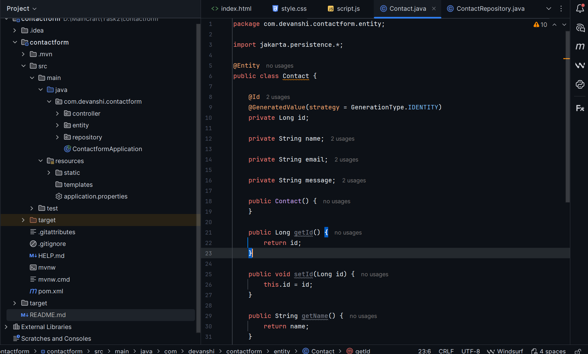
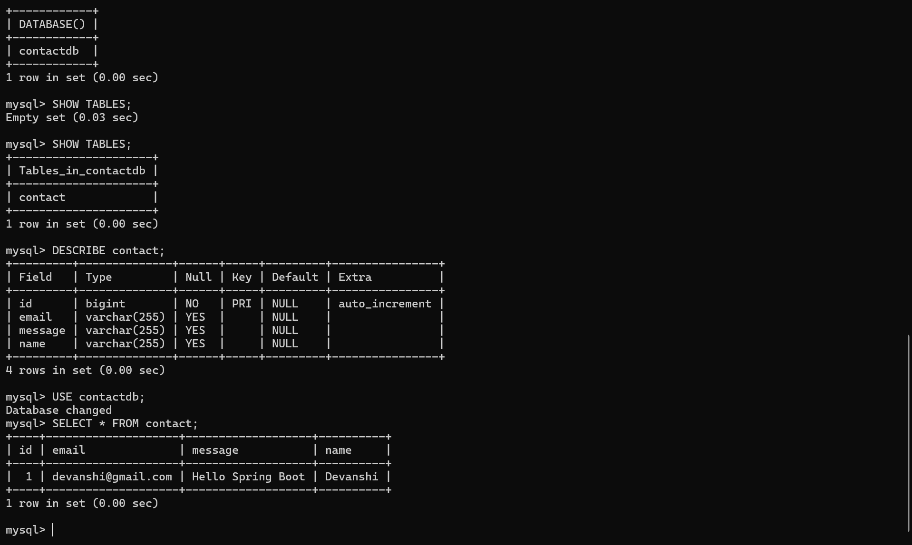
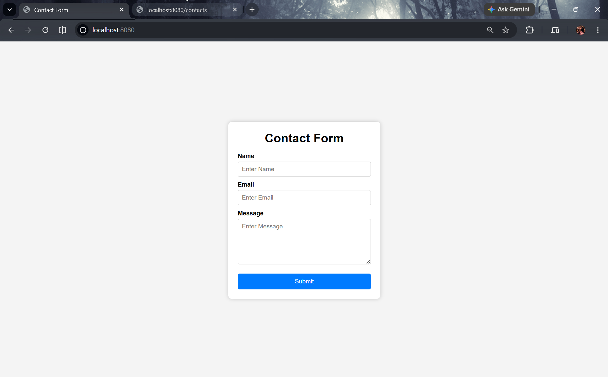
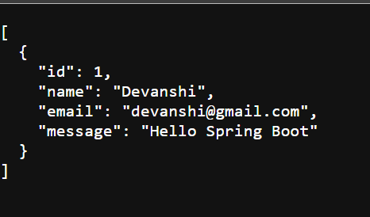

# 📞 Contact Form - Spring Boot + MySQL

A simple and responsive **Contact Form** application developed using **Spring Boot**, **Spring Data JPA**, and **MySQL**. The application allows users to submit their contact details through a web form, stores the data in a MySQL database, and provides a REST API to retrieve all submitted contacts.

---

## ✨ Features

- 📋 Responsive Contact Form
- 💾 Store contact details in MySQL
- 🔄 REST API for retrieving contacts
- ⚡ Spring Boot backend
- 🗃️ Spring Data JPA with Hibernate
- 🔌 MySQL database integration
- 🌐 Frontend built with HTML, CSS, and JavaScript

---

## 🛠️ Tech Stack

| Technology | Version |
|------------|---------|
| Java | 21 |
| Spring Boot | 3.5.16 |
| Spring Data JPA | Latest |
| Hibernate | Latest |
| MySQL | 8.x |
| Maven | Latest |
| HTML5 | ✔ |
| CSS3 | ✔ |
| JavaScript | ✔ |

---

## 📂 Project Structure

```text
contactform
│── src
│   ├── main
│   │   ├── java
│   │   │   └── com.devanshi.contactform
│   │   │       ├── controller
│   │   │       │     └── ContactController.java
│   │   │       ├── entity
│   │   │       │     └── Contact.java
│   │   │       ├── repository
│   │   │       │     └── ContactRepository.java
│   │   │       └── ContactformApplication.java
│   │   │
│   │   └── resources
│   │       ├── static
│   │       │     ├── index.html
│   │       │     ├── style.css
│   │       │     └── script.js
│   │       └── application.properties
│
├── screenshots
│   ├── api-response.png
│   ├── database.png
│   ├── form.png
│   └── program.png
│
├── pom.xml
├── README.md
└── .gitignore
```

---

## 🚀 Getting Started

### Prerequisites

Make sure the following software is installed:

- Java 21
- Maven
- MySQL Server
- IntelliJ IDEA Community Edition

---

## 🗄️ Database Setup

Login to MySQL:

```sql
mysql -u root -p
```

Create a database:

```sql
CREATE DATABASE contactdb;
```

Use the database:

```sql
USE contactdb;
```

---

## ⚙️ Configure Database

Open:

```
src/main/resources/application.properties
```

Update the following properties:

```properties
spring.application.name=contactform

spring.datasource.url=jdbc:mysql://localhost:3306/contactdb
spring.datasource.username=root
spring.datasource.password=YOUR_MYSQL_PASSWORD

spring.jpa.hibernate.ddl-auto=update
spring.jpa.show-sql=true
spring.jpa.properties.hibernate.format_sql=true
```

Replace `YOUR_MYSQL_PASSWORD` with your MySQL root password.

---

## ▶️ Running the Application

Run the Spring Boot application by executing:

```
ContactformApplication.java
```

Or use Maven:

```bash
mvn spring-boot:run
```

After the application starts successfully, open your browser and visit:

```
http://localhost:8080
```

---

## 🌐 REST API

### Save Contact

**POST**

```
/submit
```

### Sample Request

```json
{
  "name": "Devanshi",
  "email": "devanshi@gmail.com",
  "message": "Hello Spring Boot"
}
```

---

### Get All Contacts

**GET**

```
/contacts
```

### Sample Response

```json
[
  {
    "id": 1,
    "name": "Devanshi",
    "email": "devanshi@gmail.com",
    "message": "Hello Spring Boot"
  }
]
```

---

# 📸 Screenshots

## Source Code



---


## MySQL Database



---


## Contact Form



---


## API Response



---

## 📚 Learning Outcomes

During this project, I learned:

- Spring Boot project setup
- Spring MVC architecture
- Spring Data JPA
- Hibernate ORM
- Entity creation and mapping
- Repository interfaces
- REST API development
- MySQL integration
- JSON request and response handling
- Fetch API with JavaScript
- Maven project management

---

## 🔮 Future Improvements

- Input validation using Bean Validation
- Email notifications after form submission
- Admin dashboard to manage contacts
- Search and filter contacts
- Pagination support
- Docker containerization
- Deploy on AWS, Render, or Railway

---

## 👩‍💻 Author

**Devanshi Pandey**

B.Tech Computer Science Engineering

Java Full Stack Developer

GitHub: https://github.com/YOUR_GITHUB_USERNAME

LinkedIn: https://linkedin.com/in/YOUR_LINKEDIN_USERNAME

---

## ⭐ Support

If you found this project helpful, consider giving it a ⭐ on GitHub.